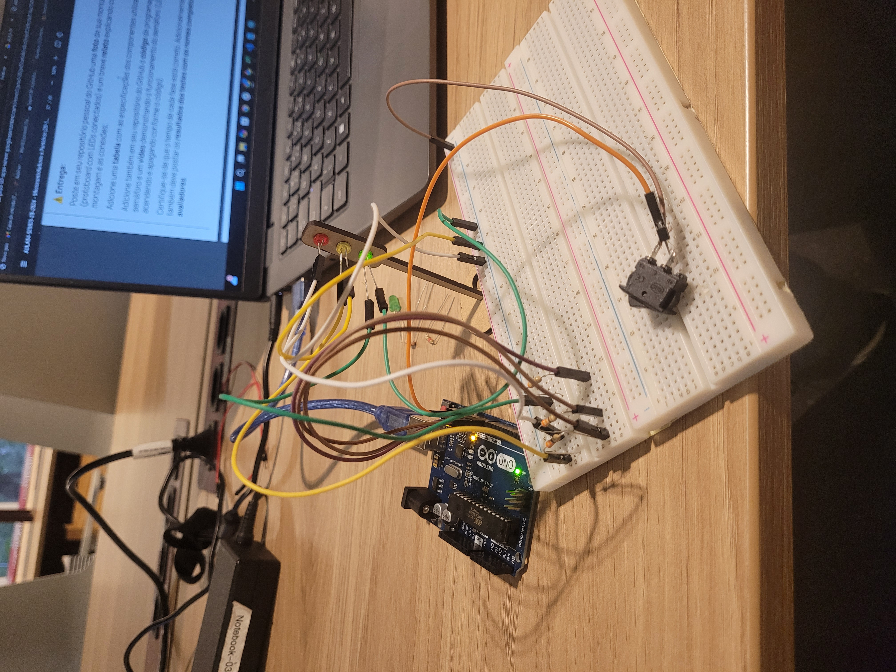

# Montagem física
&nbsp;&nbsp;&nbsp;&nbsp; Abaixo, segue a imagem da montagem física do arduíno em que é feito o controle do semáforo.

<video controls src="assets/video-semaforo.mp4" title="Title"></video>



&nbsp;&nbsp;&nbsp;&nbsp; A montagem foi feita de maneira em que o polo positivo de cada LED, passando por um resistor, foi conectado a uma porta digital. Já os polos negativos, foram conectados lado a lado na protoboard. Um fio sai de todos esses polos negativos e vai para uma haste do interruptor. Da outra haste desse interruptor sai um fio que conecta-se ao GND. Por meio desse interruptor, pode-se interromper a corrente, dando ao usuário a possibilidade de abrir ou fechar o circuito.

## Tabela de componentes
| Componente     | Quantidade | Especificações                          |
|----------------|------------|-----------------------------------------|
| Arduino Uno    | 1          | 5V e 14 pinos digitais |
| LED            | 1          | Vermelho                   |
| LED            | 1          | Amarelo                   |
| LED            | 1          | Verde                   |
| Resistores     | 3          | 330ohm  |
| Protoboard     | 1          | 400 pontos        |
| Jumpers   | 10        | Fios conectores |
| Chave Gangorra KCD11-101| 1        | Interruptor

# Código

``` int green = 8;      // Define o pino do LED verde
int yellow = 9;     // Define o pino do LED amarelo
int red = 10;       // Define o pino do LED vermelho

void setup() {
  pinMode(red, OUTPUT);    // Configura o LED vermelho como saída
  pinMode(yellow, OUTPUT); // Configura o LED amarelo como saída
  pinMode(green, OUTPUT);  // Configura o LED verde como saída
}

void loop() {
  digitalWrite(red, HIGH);      // Acende o LED vermelho
  delay(6000);                  // Aguarda 6 segundos
  
  digitalWrite(yellow, HIGH);   // Troca para amarelo
  delay(2000);                  // Aguarda 2 segundos

  digitalWrite(green, HIGH);    // Troca para verde
  delay(2000);                  // Aguarda 2 segundos
  
  for (int i = 0; i < 3; i++) { // Pisca o LED verde 3 vezes
    digitalWrite(green, LOW);
    delay(500);
    digitalWrite(green, HIGH);
    delay(500);
  }

  digitalWrite(yellow, HIGH);   // Volta para amarelo
  delay(2000);                  // Aguarda 2 segundos
} 
```


# Avaliação em Pares

#### Avaliador: Lucas Paiva Brasil

| Critério                                                                                                 | Contempla (Pontos) | Contempla Parcialmente (Pontos) | Não Contempla (Pontos) | Observações do Avaliador |
|---------------------------------------------------------------------------------------------------------|--------------------|----------------------------------|--------------------------|---------------------------|
| Montagem física com cores corretas, boa disposição dos fios e uso adequado de resistores                | 2,5             |                       |                      |                       A montagem do circuito está correta, mas acredito que as cores dos jumpers poderiam ser mais representativas.    |
| Temporização adequada conforme tempos medidos com auxílio de algum instrumento externo                  | 3              |                          |                        | Temporização correta de acordo com o que foi proposto.                          |
| Código implementa corretamente as fases do semáforo e estrutura do código (variáveis representativas e comentários) |    3        |                          |                        |  Código escrito da maneira correta, as variáveis são explicativas e o código é legível.                       |
| Extra: Implementou um componente de liga/desliga no semáforo e/ou usou ponteiros no código | 1           |                         |                        |                       Preferiu pelo uso de botões e os implementou da maneira correta e funcional    |
|  |                                                             |  | |*Pontuação Total*  9,5|

#### Avaliador: Caio Alcântara

| Critério                                                                                                 | Contempla (Pontos) | Contempla Parcialmente (Pontos) | Não Contempla (Pontos) | Observações do Avaliador |
|---------------------------------------------------------------------------------------------------------|--------------------|----------------------------------|--------------------------|---------------------------|
| Poderia ter usado cores melhores, como o preto para o negativo, por exemplo.              | 2             |                       |                      |                       A montagem do circuito está correta, mas acredito que as cores dos jumpers poderiam ser mais representativas.    |
| Temporização adequada conforme tempos medidos com auxílio de algum instrumento externo                  | 3              |                          |                        | Os tempos estão corretos.                          |
| Código implementa corretamente as fases do semáforo e estrutura do código (variáveis representativas e comentários) |    3        |                          |                        |  Código está correto, principalmente no uso do loop para aumentar a escalabilidade.                    |
| Extra: Implementou um componente de liga/desliga no semáforo e/ou usou ponteiros no código | 1           |                         |                        |                       O interruptor foi uma boa e criativa solução.   |
|  |                                                             |  | |**Pontuação Total**  9|